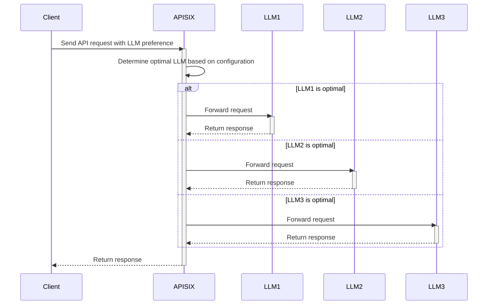
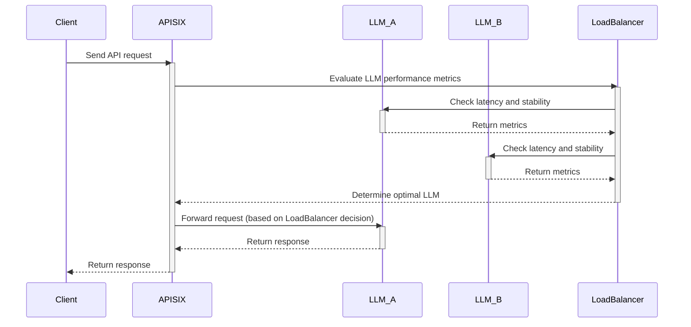

>This article will provide an in-depth look at the AI gateway features of the current and upcoming versions of APISIX. As a multifunctional API and AI gateway, Apache APISIX offers efficient and secure LLM API calls for AI applications.

<!--truncate-->

## Introduction: The Rise of AI Agents and the Evolution of AI Gateway

In recent years, AI agents such as AutoGPT, Chatbots, and AI Assistants have seen rapid development. These applications rely heavily on API calls to large language models (LLMs), which have brought about challenges considering high concurrency, cost control, and security.

Traditional API gateways primarily serve Web APIs and microservices and are not optimized for the unique needs of AI applications. This has led to the emergence of the concept of AI gateway. An AI gateway needs to provide enhanced capabilities in the following areas:

- **Multi-LLM Proxy**: Support for multiple LLM providers to avoid vendor lock-in.
- **Token Rate Limiting**: Prevent API abuse and optimize cost management.
- **Security Protection**: Including prompt filtering and content moderation to ensure compliance of AI applications.
- **Smart Traffic Management**: Dynamically adjust LLM weights based on cost, latency, and stability.

Apache APISIX is not only an API gateway but also an AI gateway through its plugins, helping AI applications call LLM APIs more efficiently and securely.

## LLM Proxy: Efficient Management of Multiple LLM Backends

AI applications typically do not rely on a single LLM provider but need to dynamically select the best model based on requirements. For example:

- Using OpenAI GPT-4 for general text generation and Claude for legal document processing.
- Switching between Mistral and Gemini to optimize cost and throughput.

**Apache APISIX's LLM Proxy offers the following capabilities:**

✅ Support for Multiple LLM Providers: Including OpenAI, DeepSeek, Claude, Mistral, Gemini, etc., to avoid vendor lock-in.

✅ LLM Weight and Priority Management: Adjust traffic distribution based on business needs.

✅ Multi-LLM Load Balancing: Dynamically adjust LLM weights based on latency, cost, and stability.

✅ Retry and Fallback Mechanisms: Ensure business continuity if an LLM API fails.

✅ Load Balancing Across Different Providers of the Same LLM:

For example:

- Privately deployed DeepSeek.
- Official DeepSeek API.
- DeepSeek API from Volcano Engine

Users can flexibly allocate traffic weights among different DeepSeek providers based on latency, stability, and price to achieve the best calling strategy.

These capabilities enable AI applications to adapt flexibly to different LLMs, improve reliability, and reduce API calling costs.

## AI Security Protection: Ensuring Safe and Compliant Use of AI

AI APIs may involve sensitive data, misleading information, and potential misuse. Therefore, an AI gateway needs to provide security at multiple levels.

**The AI security capabilities provided by Apache APISIX include:**

✅ **AI RAG (Retrieval-Augmented Generation)**: Supports enterprise-owned knowledge bases to reduce LLM hallucinations and improve output reliability.

✅ **Prompt Guard**: Automatically intercepts sensitive, illegal, and inappropriate prompts to prevent malicious use by users.

✅ **Prompt Decorator**: Automatically adds content before and after user input to enhance the quality of LLM-generated content.

✅ **Prompt Template**: Makes it easier for users to reuse standardized prompts and improve interaction experience.

✅ **Response Filtering & Moderation**: Intercepts sensitive or non-compliant AI-generated content.

✅ **Logging & Auditing**: Provides complete API request logs for compliance audits.

These security measures ensure that AI applications meet enterprise-level security requirements and avoid compliance risks due to misleading AI content.

## Token Observability and Management: Preventing High Bills Due to API Abuse

Calling LLM APIs consumes tokens, and API abuse can lead to significant costs. Apache APISIX provides fine-grained token monitoring and management mechanisms.

**The token management capabilities of Apache APISIX include:**

✅ Token Rate Limiting by Route/Service/Consumer/Consumer Group/Custom Dimension

✅ Support for Multiple Rate Limiting Modes:

- Single-machine vs. cluster rate limiting to accommodate different scales of AI API services.
- Fixed time window vs. sliding time window to flexibly control API rates.

✅ Different Rate Limiting Policies for Different LLMs: Prevent cost overruns.

Through Apache APISIX, enterprises can achieve fine-grained management of token resources and prevent high bills due to API abuse.

## Smart Routing: Dynamic Traffic Management for AI APIs

During AI API calls, different tasks may require different LLMs. For example:

- Code generation requests → sent to GPT-4 or DeepSeek.
- Long-form summarization tasks → sent to Claude.
- General conversations → sent to GPT-3.5 or Gemini.

**The smart routing capabilities of Apache APISIX include:**

✅ Context-Aware Routing Based on Request Content:

- Select the optimal LLM based on prompt type.
- Allocate different models (GPT-4 Turbo vs. GPT-3.5) based on user level (paid vs. free users).

✅ Response Caching: Reduce redundant API calls and improve response speed.

These capabilities help AI APIs run more efficiently, reduce API latency, and increase throughput.

## Conclusion

With the rapid development of AI technology, API gateways also need to evolve to meet the unique needs of AI applications. Apache APISIX, with its LLM Proxy, token rate limiting, security protection, and smart routing features, has become the best choice for an AI gateway.

**The core advantages of Apache APISIX compared to traditional API gateways are:**

🚀 Support for Multiple LLM Providers: Avoid vendor lock-in.

⚡️ Smart Traffic Scheduling: Dynamic load balancing to improve API reliability.

🔒 Built-in Security Capabilities: Including prompt protection and content moderation to ensure secure and compliant AI APIs.

💰 Token Rate Limiting: Prevent high bills due to API abuse.

📊 High-performance Architecture: Meet the high concurrency needs of AI applications.

If you are building AI-related applications and want to have both a powerful API gateway and AI gateway, give Apache APISIX a try!
