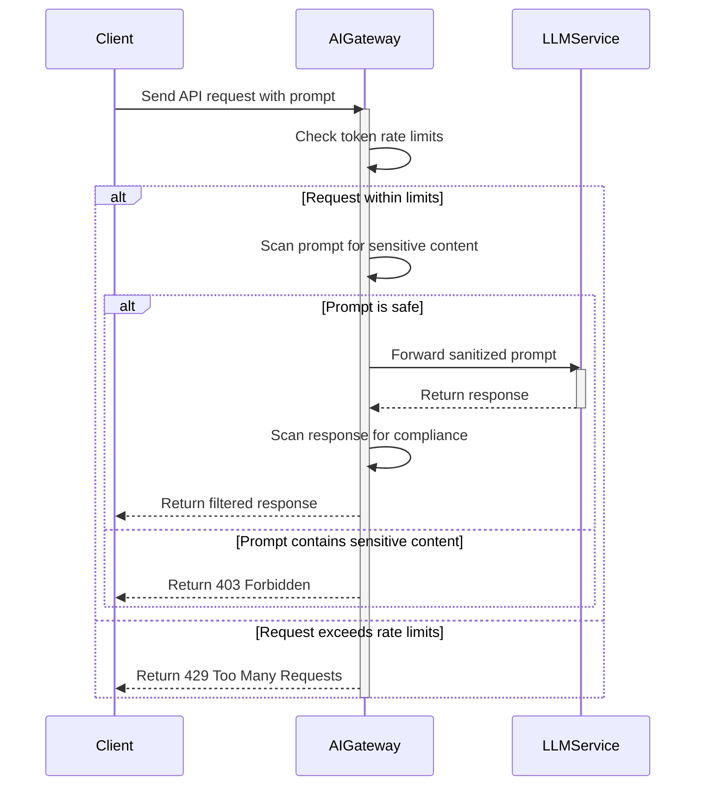
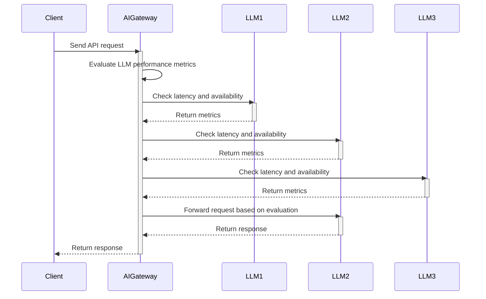

>This article will explore how AI gateway address pressing API gateway concerns. Let's discover how AI gateways unlock the full potential of AI, turning challenges into opportunities for growth.

<!--truncate-->

## Introduction

In the rapidly evolving landscape of artificial intelligence (AI), Large Language Models (LLMs) and AI agents have become integral to various applications, leading to a surge in AI-related API traffic. As organizations increasingly integrate AI into their workflows, they face new challenges in managing and optimizing AI-driven interactions.

The advent of open-source LLMs, such as [Deepseek](https://www.deepseek.com/), has enabled enterprises to not only utilize SaaS LLM services from providers like OpenAI and Azure but also to deploy LLMs internally, fostering a hybrid cloud architecture. This shift presents numerous challenges, including data security, multi-LLM adaptation and management, performance optimization, and reliability assurance. Addressing these challenges necessitates the evolution of a traditional API gateway into a specialized [AI gateway](https://apisix.apache.org/blog/2025/02/24/apisix-ai-gateway-features/).

As a PMC member of [Apache APISIX](https://apisix.apache.org/), I have also observed this trend and demand from the open-source community.

## The Rise of LLMs and AI Agents

LLMs and AI agents have transformed how businesses operate, offering enhanced capabilities in natural language understanding, generation, and decision-making. These AI-powered models are now being leveraged in diverse applications, such as:

- **Customer support automation**: AI chatbots and virtual assistants are replacing traditional customer support workflows.
- **Code generation and software development**: AI-powered tools like GitHub Copilot and DeepSeek assist developers in writing and debugging code.
- **Financial and legal analysis**: AI models help professionals analyze legal contracts and financial statements.
- **Content generation**: AI is being used to create marketing content, news articles, and technical documentation.

This transformation has led to an exponential increase in API traffic as applications rely on AI services to process and generate data. The integration of AI into business processes has become a pivotal factor in maintaining a competitive edge, requiring organizations to rethink their API management strategies.

## Emergence of Hybrid Cloud Architectures with Open-Source LLMs

The availability of open-source LLMs, such as Deepseek, has empowered organizations to deploy AI models within their own infrastructure. This capability facilitates a hybrid cloud approach, combining public SaaS LLM services with private deployments. While this strategy offers flexibility and control, it also introduces complexities in managing diverse AI environments, ensuring consistent performance, and maintaining security across platforms.

### Challenges in Managing AI-Driven API Traffic

The integration of AI services into applications brings forth several challenges:

#### 1. Data Security

Transmitting sensitive information to external LLM providers raises concerns about data privacy, regulatory compliance (such as [GDPR](https://gdpr-info.eu/) and [CCPA](https://oag.ca.gov/privacy/ccpa)), and potential data leaks. Organizations must implement robust security measures, such as:

- Data masking and redaction before sending prompts to external AI services.
- Role-based access control (RBAC) to limit access to sensitive AI functionalities.
- Encryption of data in transit and at rest to protect against unauthorized access.

#### 2. Multi-LLM Adaptation and Management

Different AI tasks require specific LLMs tailored to particular domains, such as coding, user interface design, legal analysis, or financial modeling. Enterprises need to develop strategies to efficiently:

- Route AI requests to the most suitable model based on task requirements.
- Dynamically switch between different LLM providers based on cost, availability, or latency.
- Monitor and optimize performance across multiple AI models to ensure consistent quality.

#### 3. Performance and Cost Optimization

LLM inference is computationally expensive, leading to significant costs. AI gateway must help optimize resource utilization by:

- Caching AI responses to reduce redundant API calls.
- Implementing token metering to track and control API usage.
- Load balancing AI requests across multiple providers to optimize response time and cost-efficiency.

#### 4. Reliability

As AI systems become integral to business operations, ensuring their reliability is paramount. Organizations must implement mechanisms such as:

- Retry logic and failover strategies to mitigate downtime when an LLM provider experiences service disruptions.
- Circuit breakers to prevent overloading AI services during peak demand.
- Latency-based routing to ensure users receive responses from the fastest available LLM instance.

## The Role of AI Gateway

To address these challenges, the concept of an AI gateway has emerged. An AI gateway extends the functionalities of a traditional API gateway by incorporating features specifically designed for AI applications and LLM scenarios. It serves as a unified endpoint for connecting AI infrastructure and services, providing comprehensive control, security, and observability of AI traffic between applications and models.

### Core Features of an AI Gateway

An effective AI gateway encompasses several key functionalities:

#### 1. Security

- **Token-Based Rate Limiting**: Controls the rate of requests to AI services, preventing abuse and managing resource utilization.
- **Prompt Protection**: Ensures that prompts sent to LLMs do not contain sensitive or inappropriate content, safeguarding against unintended data exposure.
- **Content Moderation**: Monitors and filters responses from AI models to prevent the dissemination of harmful or non-compliant information.

#### 2. Observability

- **Usage Tracking**: Monitors token consumption and provides insights into how AI services are utilized, aiding in cost management and capacity planning.
- **Logging and Auditing**: Maintains detailed records of AI interactions, supporting compliance and facilitating troubleshooting.
- **Real-time Monitoring**: Tracks LLM response times, error rates, and API usage patterns to ensure optimal performance.

#### 3. Prompt Engineering

- **Retrieval-Augmented Generation (RAG)**: Enhances prompts with relevant data to improve the quality and accuracy of AI responses.
- **Prompt Decorators and Templates**: Standardizes and enriches prompts to ensure consistency and effectiveness across different AI applications.
- **Dynamic Context Injection**: Automatically enhances user queries with contextual data to improve AI-generated responses.

#### 4. Reliability

- **Multi-LLM Load Balancing**: Distributes requests across multiple AI models to optimize performance and prevent overloading.

- **Retry and Fallback Mechanisms**: Implements strategies to handle AI service failures gracefully, ensuring uninterrupted user experiences.
- **Traffic Prioritization**: Routes high-priority requests to the most reliable AI services while deferring less critical tasks.

## Conclusion

The integration of AI into business operations presents both opportunities and challenges. As AI services are predominantly accessed via APIs, managing these interactions effectively is crucial. AI gateway offers a comprehensive solution by extending traditional API gateway functionalities to meet the specific needs of AI applications. By addressing security, observability, prompt engineering, and reliability, AI gateway enables organizations to harness the full potential of AI while maintaining control and compliance.

As the AI landscape continues to evolve, the role of AI gateway will become increasingly significant, serving as the backbone of secure and efficient AI deployments. Organizations adopting AI gateway will gain a competitive advantage by ensuring seamless AI interactions, optimizing costs, and maintaining high-performance AI-driven applications.
