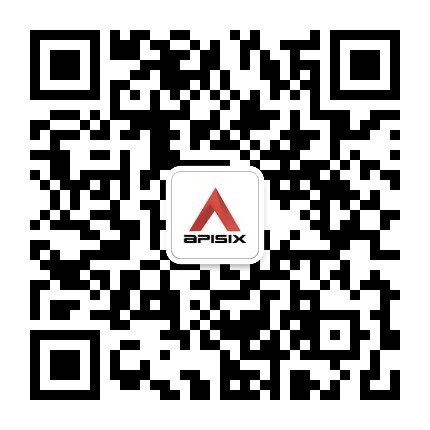

## 分享人简介

Chao Zhang: Apache APISIX PMC，OpenResty 贡献者，开源爱好者，现在我正在研究 Service Mesh、Kubernetes 和 API Gateway。

## 分享主题介绍

在这个主题中，我将介绍 apisix-mesh-agent 项目，它有一些能力将 Apache APISIX 扩展为服务网格场景中的边车程序，更重要的是，它使用 xDS 协议从 Istio、Kuma 等控制平面获取配置。之后，我将介绍关于在服务网中使用 Apache APISIX 的未来计划和期望。

## PPT 下载

关注 Apache APISIX 公众号，回复“ApacheCon”下载 PPT。

