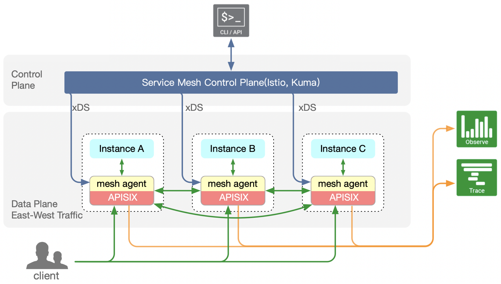

> [@tokers](https://github.com/tokers), Apache APISIX PMC from [Shenzhen Zhiliu Technology Co.](https://www.apiseven.com/)
>

<!--truncate-->
基于 Apache APISIX 开发的服务网格项目正式开源！欢迎大家下载使用。

## 什么是服务网格

服务网格（Service Mesh），作为服务间通信的中间层，将诸如服务发现、负载均衡、熔断、限流、重试等的基础功能，下沉到一个轻量级的边车（Sidecar）组件，使得应用程序开发者可以更聚焦于应用本身的开发，不需要关注这类基础功能，从而提升开发效率。

## 什么时候需要服务网格

### 案例一

A 公司微服务的技术栈涉及 Go、Java 和 C++ 等不同语言，同时为每种开发语言设计了基础框架，以完成服务治理的功能，然而每次框架的更新都需要覆盖各语言的版本以及联系所有业务开发团队进行更新。并且不同语言的框架由不同团队维护，导致沟通成本高昂且容易出现不兼容情况。

因而 A 公司的架构师决定引入服务网格方案，将所有服务治理的能力下沉到网格，基础功能迭代不再与业务开发耦合，同时业务开发不再依赖开发框架，业务本身更加简洁。

### 案例二

B 公司现有的服务治理框架功能落后，年久失修，因业务发展及合规性等原因，现在需要实现协议转换和双向认证，技术负责人调研以后决定引入服务网格方案，借助网格的能力实现这些功能，同时摆脱现有服务治理框架的历史债，使得所有应用变得更加稳定和轻量。

## 使用 Apache APISIX 搭建服务网格

鉴于 Apache APISIX 的优秀设计，我们不仅可以将 Apache APISIX 用于南北向流量管理，也可以用它管理服务网格的东西向流量，我们通过引入 APISIX-Mesh-Agent 这一组件，配合 Apache APISIX 进行使用，从而使得 Apache APISIX 可以对接业内广泛使用的服务网格控制面，例如： Istio 和 Kuma 等。

APISIX-Mesh-Agent 作为 Apache APISIX 的协议适配器，实现了 Envoy xDS 协议，将数据从 xDS 格式转换为 Apache APISIX 兼容的格式。

同时其实现了 ETCD V3 API 使得在 Apache APISIX 看来，它就是一个 ETCD 集群，由于 Apache APISIX 对 ETCD 的原生支持, 配置即可顺利地从某个服务网格控制面下发到 Apache APISIX 。

得益于 Apache APISIX 的良好设计，基于 Apache APISIX 的服务网格方案性能更佳、资源占用更少、二次开发和定制的成本更低（Lua 语言上手容易，且 Apache APISIX 已经支持使用多语言进行插件开发），并且由于兼容 xDS 协议，从 Istio、Kuma 等网格方案进行迁移也更加平滑。

## 下载

下载 APISIX-Mesh-Agent 0.6-Release 源代码及二进制安装包，请访问下载页面。
`https://github.com/api7/apisix-mesh-agent/releases/tag/0.6`

## 文档更新

在本次发布过程中，我们也在持续更新和发布新的使用文档，欢迎大家提出宝贵的意见。
`https://github.com/api7/apisix-mesh-agent/tree/main/docs`
