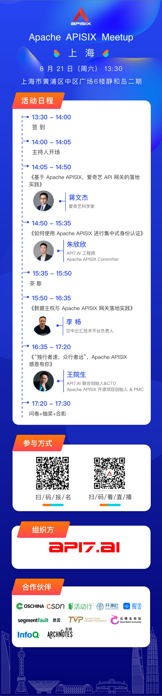
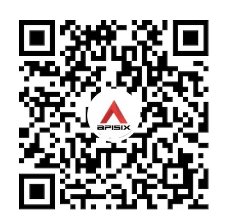

<!--truncate-->
本次 Meetup 由 [API7.AI](https://www.apiseven.com/) 发起，并邀请爱奇艺、空中云汇等合作伙伴共同为大家呈现。Apache APISIX core developer、Apache APISIX PMC 成员、社区技术专家汇聚一堂，共同探讨 Apache APISIX 社区发展、行业实践等话题。

#### 时间：2021 年 8 月 21 日 13:30

#### 地点：上海市黄浦区中区广场 6 楼静和岛二期

## 参加本次 Meetup，你可以

- 与 Apache APISIX core developer 们共同探讨 Apache APISIX 社区的前世今生
- 听爱奇艺科学家讲述，爱奇艺是如何使用 Apache APISIX 支撑起千万级调用量的服务的
- 空中云汇是如何在使用 Apache APISIX 时兼顾用户体验、整洁架构与数据主权的
- 了解集中式身份认证的优点以及如何在 APISIX 上进行集中式身份认证

如果你感兴趣的话，千万不要错过，**扫描活动海报二维码报名吧！**

tips：疫情防控不放松，我们将会控制现场活动规模，名额有限，报名从速！

## 活动安排

## 周边福利

参加 Meetup，与讲师互动，有机会获得 Apache APISIX 最新周边：超大鼠标垫、精致马克杯、Apache APISIX 徽章、定制雨伞。

## 参与方式

### 现场报名

扫描上方活动海报二维码即可报名！

### 线上直播

如果不能到现场参加 Meetup，关注 Apache APISIX 视频号观看直播。

## 入群交流

欢迎关注 Apache APISIX 公众号，在后台回复关键字“上海”，加入 Apache APISIX 上海交流群。

