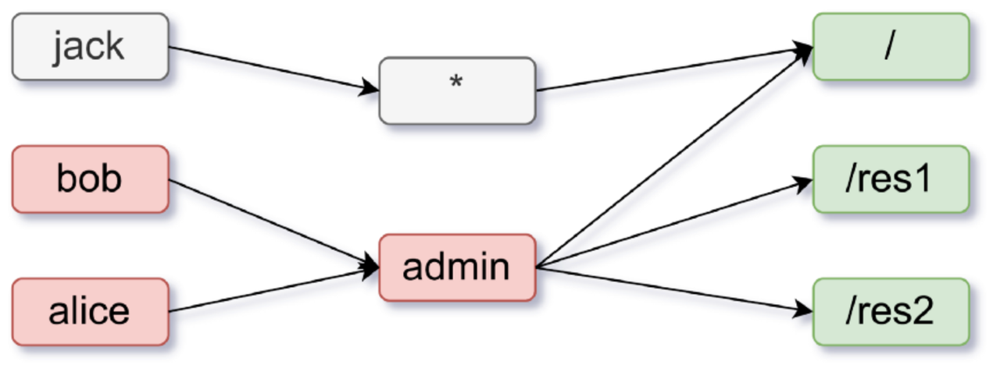

<!--truncate-->
## Introduciton

When using Apache APISIX, you may want to add complex authorization logic to your application. In this article, we will use the built-in Casbin plugin (authz-casbin) of Apache APISIX to implement the role-based access control (RBAC) model.

### About Apache APISIX

[Apache APISIX](https://apisix.apache.org/) is a dynamic, real-time, high-performance API gateway that provides load balancing, dynamic upstream, canary release, fine-grained routing, limit rate, service degradation, circuit breaking, authentication, observability, and hundreds of other features. You can use Apache APISIX to proxy traditional NORTH-SOUTH traffic, as well as EAST-WEST traffic between services, or as a k8s ingress controller.

### About Casbin

[Casbin](https://casbin.org/en/) is a powerful and efficient open-source access control library. It provides support for enforcing authorization based on various access control models like ACL, RBAC, ABAC for Golang, Java, Node.js, PHP, Python, .NET (C#), Delphi and Rust.

### About authz-casbin Plug-in

A contradiction between route matching and request authorization occurs when using Apache APISIX: in order to accurately identify authorize requests, users need to configure higher granularity routes. In scenarios with complex authorization models, this leads to an exponential increase in the number of routes, as well as a huge increase in complexities and costs of maintenance.

The authz-casbin is an Apache APISIX plugin based on [lua-casbin](https://github.com/casbin/lua-casbin) that supports powerful authorization based on various access models. Casbin is a powerful and efficient open-source access control framework that supports ACL, RBAC, ABAC and other access control models, lua-casbin is the Lua version of the authorization access model.

The authz-casbin plugin allows you to decouple the route matching and request authorization functions so that you can load various authorization access models into Apache APISIX and implement an efficient and complex authorization model with lua-casbin.

**Note**: If you want to implement authentication, you need to use other plugins or configure yourself as an authenticate user.

## How to Use authz-casbin

### Create a Model

The authz-casbin plugin uses three parameters for authorization: `subject`, `object` and `action`. `subject` is the username, which refers to the user in the request; `object` is the URL link that will be accessed, i.e. the resource that will be accessed; and `action` is the action requested for authorization, such as read or write.

For example, if you want to create a model to access three resources: main page`/`, resource1 `/res1`, and resource2 `/res2`, you will need a model that looks like the figure below:



In this model, all users, including Jack, have access to the main page `/`. Users with administrator privileges, such as Alice and Bob, can access all pages and resources (main page `/`, resource1 `/res1`, and resource 2 `/res2`). Thus, you need to restrict users without administrator privileges to access specific resources using the GET request method. The required model is shown in the code block below:

```shell
[request_definition]
r = sub, obj, act

[policy_definition]
p = sub, obj, act

[role_definition]
g = _, _

[policy_effect]
e = some(where (p.eft == allow))

[matchers]
m = (g(r.sub, p.sub) || keyMatch(r.sub, p.sub)) && keyMatch(r.obj, p.obj) && keyMatch(r.act, p.act)
```

### Create a Policy

From the above example, the policy should look like this:

```shell
p, *, /, GET
p, admin, *, *
g, alice, admin
g, bob,admin
```

The matcher in the model indicates that:

1. `(g(r.sub, p.sub) || keyMatch(r.sub, p.sub))`: the subject in the request and the subject in the policy have the same role or the subject in the request and the subject in the policy can be matched by the built-in method keyMatch. keyMatch is a built-in function of Lua Casbin, a description of which and more can be found in [lua-casbin](https://github.com/casbin/lua-casbin/blob/master/src/util/BuiltInFunctions.lua).
2. `keyMatch(r.obj, p.obj)`: the object in the request and the object in the policy can match each other (proxy for URL links).
3. `keyMatch(r.act, p.act)`: the action in the request and the action in the policy match each other (proxy for the HTTP request method).

### Using authz-casbin on a Route

Once you have created the model and policy, you can use it on the route using the APISIX admin API. To use it, you can modify model and policy's file paths at `authz-casbin.model_path` and `authz-casbin.policy_path`.

```shell
curl http://127.0.0.1:9080/apisix/admin/routes/1 -H 'X-API-KEY: edd1c9f034335f136f87ad84b625c8f1' -X PUT -d '
{
    "plugins": {
        "authz-casbin": {
            "model_path": "/path/to/model.conf",
            "policy_path": "/path/to/policy.csv",
            "username": "user"
        }
    },
    "upstream": {
        "nodes": {
            "127.0.0.1:1980": 1
        },
        "type": "roundrobin"
    },
    "uri": "/*"
}'
```

In this case, `username` is the username passed into the subject. For example, you can set `"username": "user"` to pass your defined `user:alice` to username, and modify username to Alice.

Similarly, you can put models and policies directly into authz-casbin:

```shell
curl http://127.0.0.1:9080/apisix/admin/routes/1 -H 'X-API-KEY: edd1c9f034335f136f87ad84b625c8f1' -X PUT -d '
{
    "plugins": {
        "authz-casbin": {
            "model": "[request_definition]
            r = sub, obj, act

            [policy_definition]
            p = sub, obj, act

            [role_definition]
            g = _, _

            [policy_effect]
            e = some(where (p.eft == allow))

            [matchers]
            m = (g(r.sub, p.sub) || keyMatch(r.sub, p.sub)) && keyMatch(r.obj, p.obj) && keyMatch(r.act, p.act)",

            "policy": "p, *, /, GET
            p, admin, *, *
            g, alice, admin",

            "username": "user"
        }
    },
    "upstream": {
        "nodes": {
            "127.0.0.1:1980": 1
        },
        "type": "roundrobin"
    },
    "uri": "/*"
}'
```

### Using plug-ins with Global Models or Global Policies

In some cases, you may want to use the same model and policy in multiple routes. You can first send a PUT request to send the configuration of the model and policy to the plugin's metadata:

```shell
curl <http://127.0.0.1:9080/apisix/admin/plugin_metadata/authz-casbin> -H 'X-API-KEY: edd1c9f034335f136f87ad84b625c8f1' -i -X PUT -d '
 {
 "model": "[request_definition]
 r = sub, obj, act
 [policy_definition]
 p = sub, obj, act
 [role_definition]
 g = _, _
 [policy_effect]
 e = some(where (p.eft == allow))
 [matchers]
 m = (g(r.sub, p.sub) || keyMatch(r.sub, p.sub)) && keyMatch(r.obj, p.obj) && keyMatch(r.act, p.act)",
 "policy": "p, *, /, GET
 p, admin, *, *
 g, alice, admin
 g, bob, admin"
 }'
```

Then you need to use the Admin API to send requests to make multiple routes use the same model or policy configuration:

```shell
curl http://127.0.0.1:9080/apisix/admin/routes/1 -H 'X-API-KEY: edd1c9f034335f136f87ad84b625c8f1' -X PUT -d '
{
    "plugins": {
        "authz-casbin": {
            "username": "user"
        }
    },
    "upstream": {
        "nodes": {
            "127.0.0.1:1980": 1
        },
        "type": "roundrobin"
    },
    "uri": "/*"
}'
```

This will add the plugin's configuration to the route dynamically. You can easily update the plugin's configuration by sending a request to update the model and policy in the plugin's configuration data.

## Special Thanks

Thanks to the developers in the Casbin and Apache APISIX communities, this cross-community collaboration was friendly and well organized.

Shout out to Casbin community's [rushitote](https://github.com/rushitote) for submitting issues and pull request, and shout out to Apache APISIX community's [tokers](https://github.com/tokers), [Yiyiyimu](https://github.com/Yiyiyimu), [spacewander](https://github.com/spacewander), and [tzssangglass](https://github.com/tzssangglass) for reviewing this pull request. Open source makes the world better.

Source: [Authorization in APISIX using Casbin](https://rushikeshtote.com/blog/apisix-casbin-authorization)

Related pull request: [PR#4710 feat: Added authz-casbin plugin and doc and tests for it](https://github.com/apache/apisix/pull/4710)
